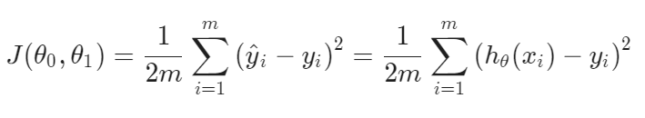

# Cost Function

<strong>We</strong> can measure the accuracy of our hypothesis function by using a cost function. This takes an average difference (actually a fancier version of an average) of all the results of the hypothesis with inputs from x's and the actual output y's.

  

<strong>To</<strong> break it apart, it is 1/2 x̅ where x̅ is the mean of the squares of h_\θ(x_i) - y_i //θ - theta or the difference between the predicted value and the actual value.
This function is otherwise called the "Squared error function", or "Mean squared error". The mean is halved (1/2)
as a convenience for the computation of the gradient descent, as the derivative term of the square function will cancel out the 1/2
term. The following image summarizes what the cost function does:

