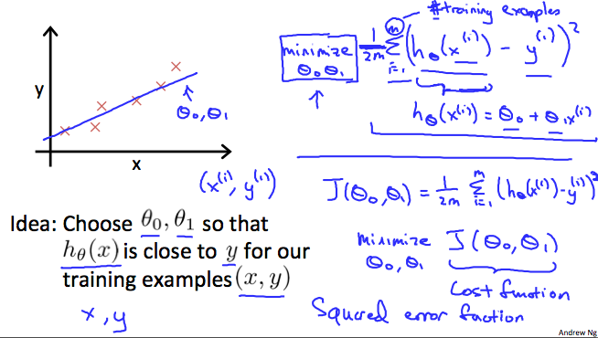

# Cost Function

<strong>We</strong> can measure the accuracy of our hypothesis function by using a cost function. This takes an average difference (actually a fancier version of an average) of all the results of the hypothesis with inputs from x's and the actual output y's.

<strong>To</strong> break it apart, it is <strong>1/2 x̅</strong> where <strong>x̅</strong> is the mean of the squares of <strong>h_\θ(x_i) - y_i //θ - theta</strong> or the difference between the predicted value and the actual value.

This function is otherwise called the "Squared error function", or "Mean squared error". The mean is halved <strong>(1/2)</strong>
as a convenience for the computation of the gradient descent, as the derivative term of the square function will cancel out the <strong>1/2</strong>
term. The following image summarizes what the cost function does:

